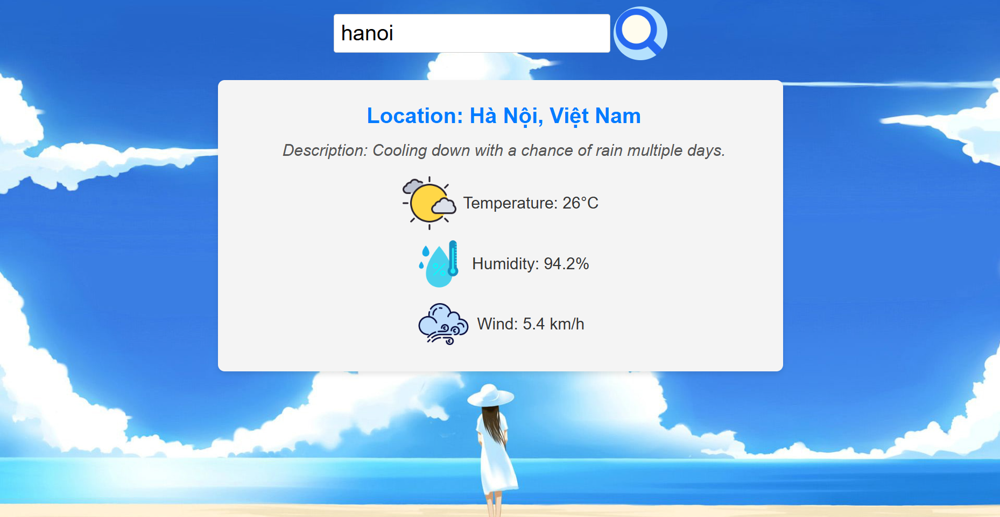

# Simple Weather App

This is a simple weather application that allows you to search for weather information by city name.

## Features

* Search weather by city name (in English).
* Displays key weather details like temperature, description, humidity, and wind speed.

## Project Link

This project is part of the weather app on roadmap.sh. You can find the project page here:
[Weather App on roadmap.sh](https://roadmap.sh/projects/weather-app)

## How to Run

You don't need a complex setup to run this app. Simply:

1.  Clone or download this repository to your local machine.
2.  Open the `index.html` file in your web browser.

The app runs directly in your browser using HTML, CSS, and JavaScript.

## Screenshot

Here's a glimpse of the app:

---

**Made with ❤️ for learning.**